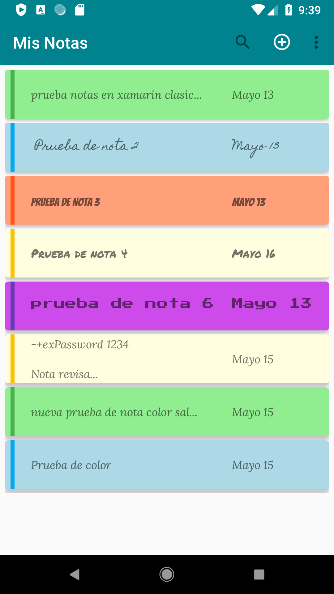
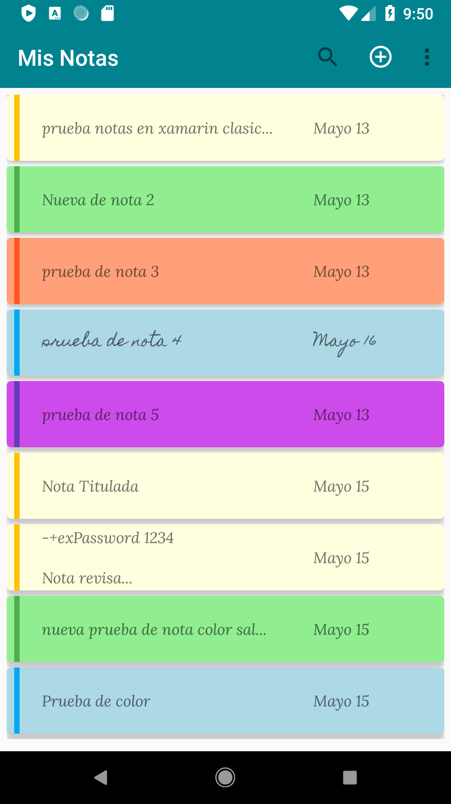
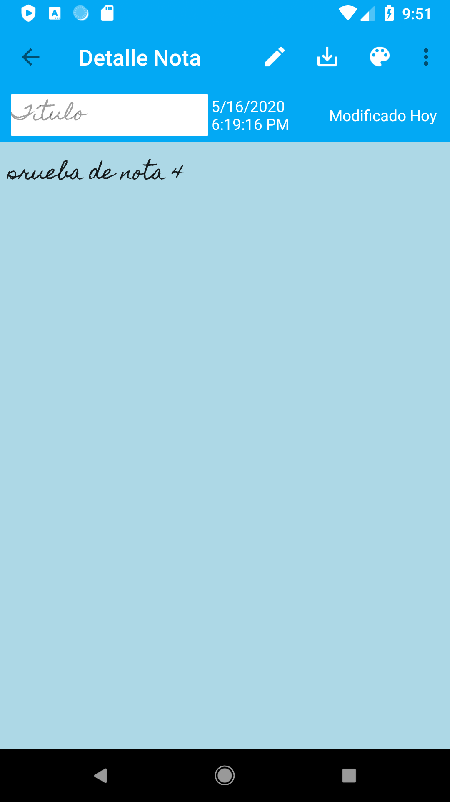

# XamiNotes
Proyecto: Registro y modificación de  Notas, escrito en  Xamarin Classics desarrollado para comprender el manejo y persistencia de datos, asi como el diseño en xml,
paquetes nuget instalados:
- sqlite-net-pcl
- Xamarin.Android.Support.V7.CardView
- Lista de notas y tareas registradas, mostradas en cardviews, 
- 
- 
- Detalles de una nota con funciones de cambio de color, tipo de letra, eliminar
- 
